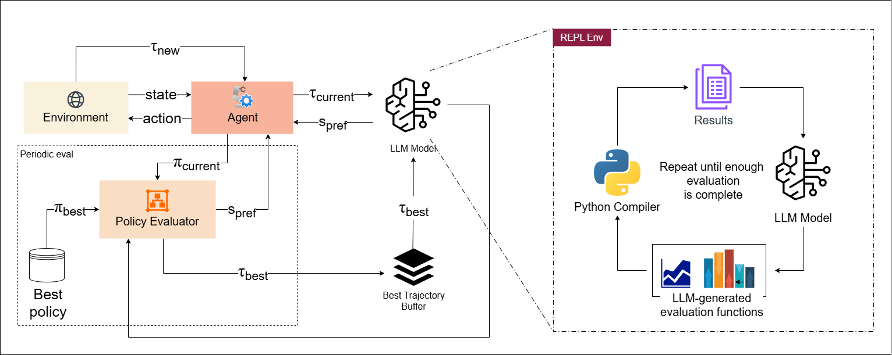
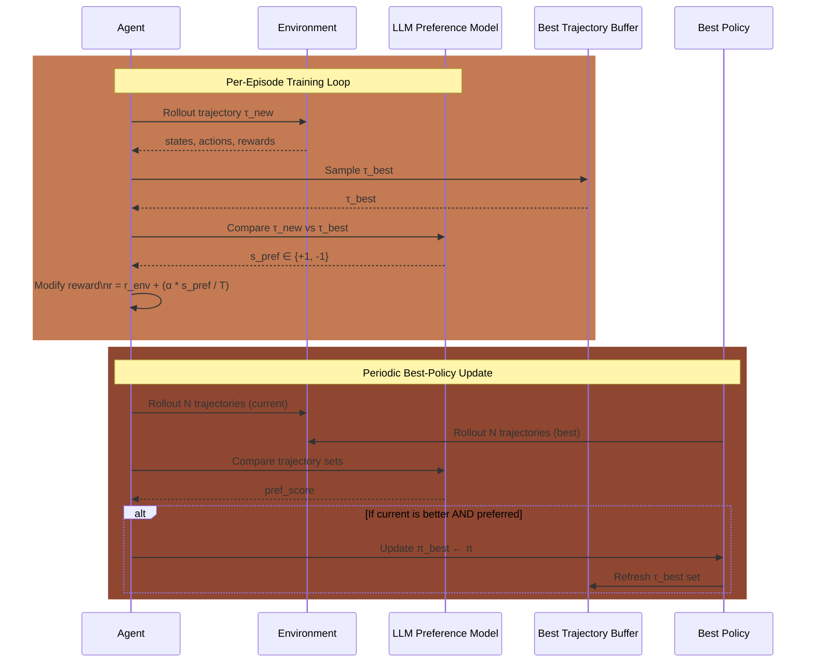

# VERDICT-RL
### Learning from Comparisons: LLMs as Critics in Reinforcement Learning

Replace fragile reward signals with reasoned judgment.

VERDICT-RL uses Large Language Models as critics to guide reinforcement learning via trajectory comparisons instead of scalar rewards.

---

## Overview

Traditional RL optimizes a scalar reward.  
This breaks down when:
- rewards are poorly specified  
- policies exploit loopholes (reward hacking)  
- tasks require semantic understanding  

VERDICT-RL replaces rewards with comparisons.

Instead of asking:
“How good is this trajectory?”

We ask:
“Which trajectory is better?”

---

## Architecture




## Training Loop



---

## Key Idea

VERDICT-RL shifts learning from:

| Traditional RL | VERDICT-RL |
|----------------|-----------|
| Scalar reward | Pairwise preference |
| Hand-designed signals | LLM reasoning |
| Opaque optimization | Interpretable critique |

---

## Setup

```bash
git clone https://github.com/your-username/verdict-rl.git
cd verdict-rl

conda create -n verdict python=3.10
conda activate verdict

pip install -r requirements.txt
```

---

## Training

Baseline (SAC)

```bash
python main/train_sac.py --env reach-v3 --seed 0 --wandb --run_name sac-reach-v3-seed-0 --device cpu
```

## VERDICT-RL

```bash
python3 main/train_verdict.py \
    --env reach-v3 \
    --seed 0 \
    --use_llm_pref \
    --wandb \
    --alpha 0.1 \
    --run_name verdict-reach-v3-seed-0 \
    --device cpu \
    --config configs/meta-reacher/reacher_trajectory.yaml

```
---

Run the two experiments separately for a clean comparison

## Logging

Login to Weights & Biases once before training:
```bash
wandb login
```

---

## Limitations

- LLM inference cost  
- Prompt sensitivity  
- Bias in comparisons  
- Training latency  

---

## Takeaway

Rewards compress behavior into a number.  
Comparisons preserve meaning.

VERDICT-RL learns from judgment, not just signals.
